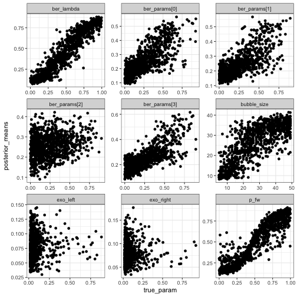
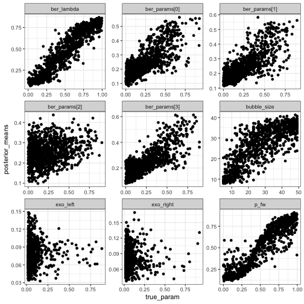

## Checking on ABC parameter estimates

Here we're checking on how well ABC can estimate the true parameters in simulations.
The summary statistics here come from the predictions from a neural net: we trained nets with a couple of different architectures to predict parameter values given mutated sequence (in `nnet-trials.R`).
Each of those nets gives us one predicted parameter vector per sequence.
To test how well ABC with these nets does, we have simulated data in which we

- Draw a parameter vector $\theta_i$ from the prior

- Draw a set of 1000 mutated sequences from the simulated with that setting of $\theta_i$

For each $\theta$_i draw, we compute summary statistics by

- Using the net to get a prediction of $\theta_i$ for each of the 1000 sequences, call it $\hat \theta_i^{(j)}$

- Average over the predictions to get $\hat \theta_i = \frac{1}{1000} \sum_{j=1}^{1000} \hat \theta_i^{(j)}$

Now we can use the set $\hat \theta_i, i = 1,\ldots, n_{sim}$ as the summary statistic and do ABC in the normal way.

To check how well this procedure does at estimating parameters, I do the following:

- Fix $i$, and let the corresponding pair of true parameters and predicted parameters $(\theta_i, \hat \theta_i)$ to correspond to the observed data, so that $\theta_i$ are the true parameters generating the data and $\hat \theta_i$ are the "observed" summary statistics.

- For some tolerance $\epsilon$, find $\{ \theta_j  : \|\hat \theta_j - \hat \theta_i\| \le q_\epsilon(\hat \theta^{(-i)} - \hat \theta_i), j \ne i\}$. This set comprises our approximate draws from the posterior of $\theta$ given "observed" summary statistics $\hat \theta_i$.

- Repeat for each $i$

In the plots below, I compute the posterior means and compare them to the true values of the parameters.


```r
library(shmr)
library(keras)
## start by loading the data
params = read.csv("for_abc_params.csv", header = FALSE)
colnames(params) = c("ber_lambda",
            "bubble_size",
            "exo_left",
            "exo_right",
            "ber_params[0]",
            "ber_params[1]",
            "ber_params[2]",
            "ber_params[3]",
            "p_fw")
seqs = read.csv("for_abc_sequences.csv", header = FALSE, stringsAsFactors = FALSE)
```


```r
## get the summary stats from the trained network
model_dense = load_model_hdf5("dense_model.hdf5")
ss_dense = get_net_summary_stats(
    seqs$V1,
    predictor_creation_fn = one_hot_1d_sequences,
    net = model_dense,
    groups = seqs$V2)
```


```r
## check the correlations between the predictions and parameters
y = params
interval_params = 5:9
logit = function(p) log(p / (1 - p))
y[,interval_params] = logit(y[,interval_params])
y = as.matrix(y)
y = scale(y)
for(i in 1:ncol(y)){
    cat(colnames(params)[i], "\n")
    cat(cor(y[,i], ss_dense[,i]), "\n")
}
```

```
## ber_lambda 
## 0.845303 
## bubble_size 
## 0.7184639 
## exo_left 
## 0.1627753 
## exo_right 
## 0.1321687 
## ber_params[0] 
## 0.6338234 
## ber_params[1] 
## 0.5802844 
## ber_params[2] 
## 0.2402832 
## ber_params[3] 
## 0.6144555 
## p_fw 
## 0.7867916
```


```r
comparisons_dense = check_abc_on_sims(params, ss_dense, match_tol = .03)
comparisons_dense %>%
    dplyr::group_by(parameter) %>%
    dplyr::summarise(cor(true_param, posterior_means))
```

```
## # A tibble: 9 x 2
##   parameter     `cor(true_param, posterior_means)`
##   <fct>                                      <dbl>
## 1 ber_lambda                                0.946 
## 2 ber_params[0]                             0.767 
## 3 ber_params[1]                             0.737 
## 4 ber_params[2]                             0.237 
## 5 ber_params[3]                             0.762 
## 6 bubble_size                               0.797 
## 7 exo_left                                  0.0708
## 8 exo_right                                 0.0577
## 9 p_fw                                      0.923
```

```r
ggplot(comparisons_dense) +
    geom_point(aes(x = true_param, y = posterior_means)) +
    facet_wrap(~ parameter, scales = "free")
```




```r
model_recurrent = load_model_hdf5("recurrent_model_1.hdf5")
ss_recurrent = get_net_summary_stats(
    seqs$V1,
    predictor_creation_fn = one_hot_2d_sequences,
    net = model_recurrent,
    groups = seqs$V2)
```


```r
comparisons_recurrent = check_abc_on_sims(params, ss_recurrent, match_tol = .03)
comparisons_recurrent %>%
    dplyr::group_by(parameter) %>%
    dplyr::summarise(cor(true_param, posterior_means))
```

```
## # A tibble: 9 x 2
##   parameter     `cor(true_param, posterior_means)`
##   <fct>                                      <dbl>
## 1 ber_lambda                                0.941 
## 2 ber_params[0]                             0.767 
## 3 ber_params[1]                             0.761 
## 4 ber_params[2]                             0.259 
## 5 ber_params[3]                             0.786 
## 6 bubble_size                               0.805 
## 7 exo_left                                  0.0561
## 8 exo_right                                 0.0661
## 9 p_fw                                      0.924
```

```r
ggplot(comparisons_recurrent) +
    geom_point(aes(x = true_param, y = posterior_means)) +
    facet_wrap(~ parameter, scales = "free")
```


